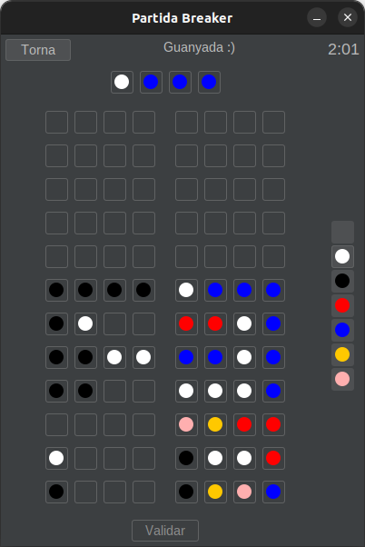

# Mastermind

A Mastermind desktop application created for the *Programming Projects* subject at FIB-UPC (spring 2023).

  

## Main features

To use the application, you will first need to register a user. Then, you can:

- Learn the game's rules
- Play Mastermind as the *breaker* with different difficulty levels
- Watch an algorithm play as a *breaker* against your solution sequences
- View personal stats
- View the global ranking for each difficulty

## Project Structure

- **DOCS**: Documents explaining the design and usage of the application
- **FONTS**: The source code for the application and the Makefile to build it (the file `FONTS/index.txt` explains the main targets
- **EXE**: Binaries (generated by the Makefile) and test cases

## Technologies

The application has been developed in Java. We have also used:

- **Swing** for the desktop application
- **Javadoc** for documentation
- **JUnit** for testing
- **Gradle** (and a bit of **Make**) for building

## Authors

- [Albert Canales](https://github.com/albertcanales)
- [Mar Gonzàlez](https://github.com/mar-gc)
- [Kamil Przybyszewski](https://github.com/Kamil-Prz)
- [Arnau Valls](https://github.com/Toomoch)
